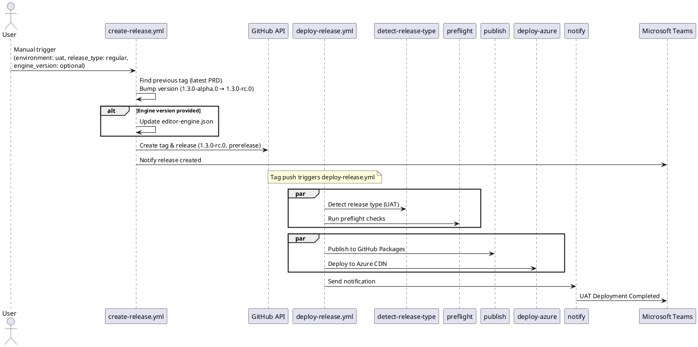
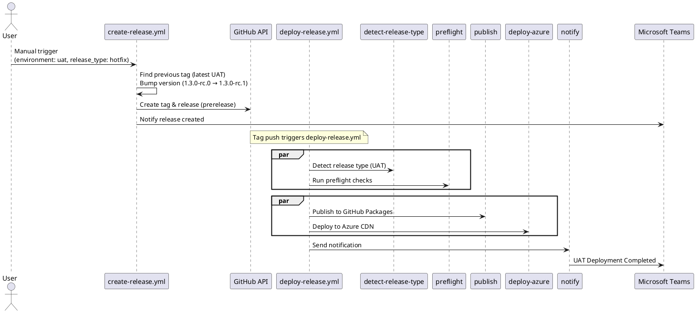
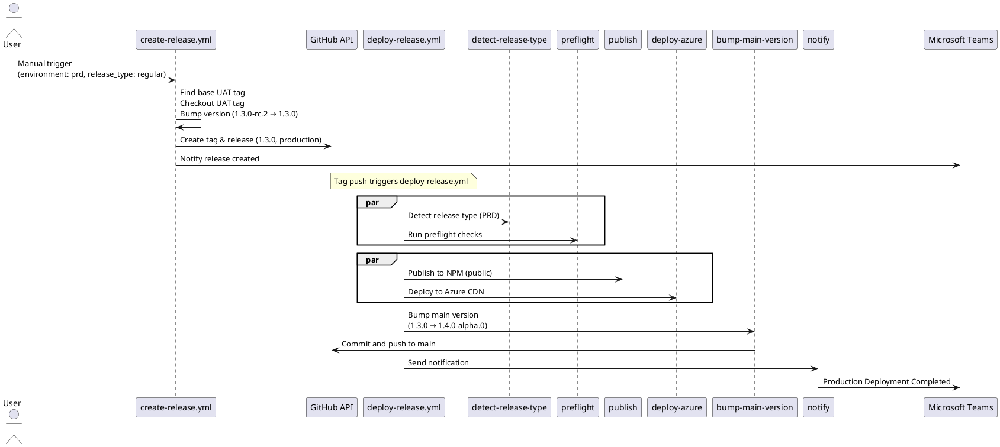
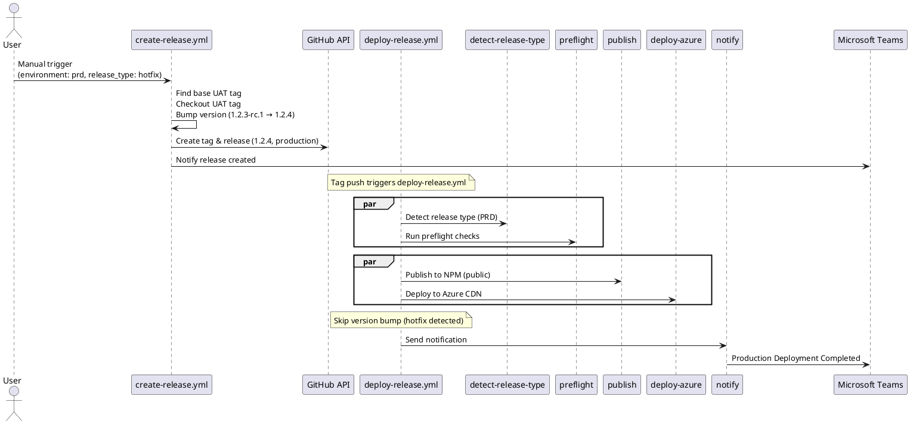

# Release Pipeline Sequence Diagram

## UAT Regular Release Flow

## UAT Hotfix Release Flow

## PRD Regular Release Flow

## PRD Hotfix Release Flow

## Key Points

1. **Create Release Workflow** (`create-release.yml`):

   - Manually triggered with inputs:
     - `environment`: uat or prd
     - `release_type`: regular or hotfix
     - `engine_version`: optional - engine version to use (e.g., 2.15.latest)
   - Determines previous tag based on environment and release type
   - For PRD: checks out UAT tag before version bump
   - **Only consumed for UAT regular releases**: If `engine_version` provided, updates `packages/sdk/editor-engine.json` before tag creation
   - Creates git tag and GitHub release
   - Sends create Github Release Teams notification

2. **Deploy Release Workflow** (`deploy-release.yml`):

   - Triggered automatically on tag push
   - `detect-release-type`: Identifies UAT vs PRD from tag format
   - `preflight`: Runs tests and linting
   - `publish`: Publishes to GitHub Packages (UAT) or NPM (PRD)
   - `deploy-azure`: Deploys to Azure CDN using service principal auth
   - `bump-main-version`: Only for PRD regular releases (skips hotfixes)
   - `notify`: Sends final Teams notification after successful deployment

3. **Version Bumping Logic**:

   - UAT Regular: Adds `-rc.0` to current version (minor already bumped)
   - UAT Hotfix: Increments prerelease number or patch+rc.0
   - PRD Regular and Hotfix: Strips `-rc.X` from UAT tag

4. **Post-Production Version Bump**:

   - Only runs for PRD regular releases (not hotfixes)
   - Bumps main branch to next minor version with `-alpha.0`
   - Preserves patch space for potential additional hotfixes
