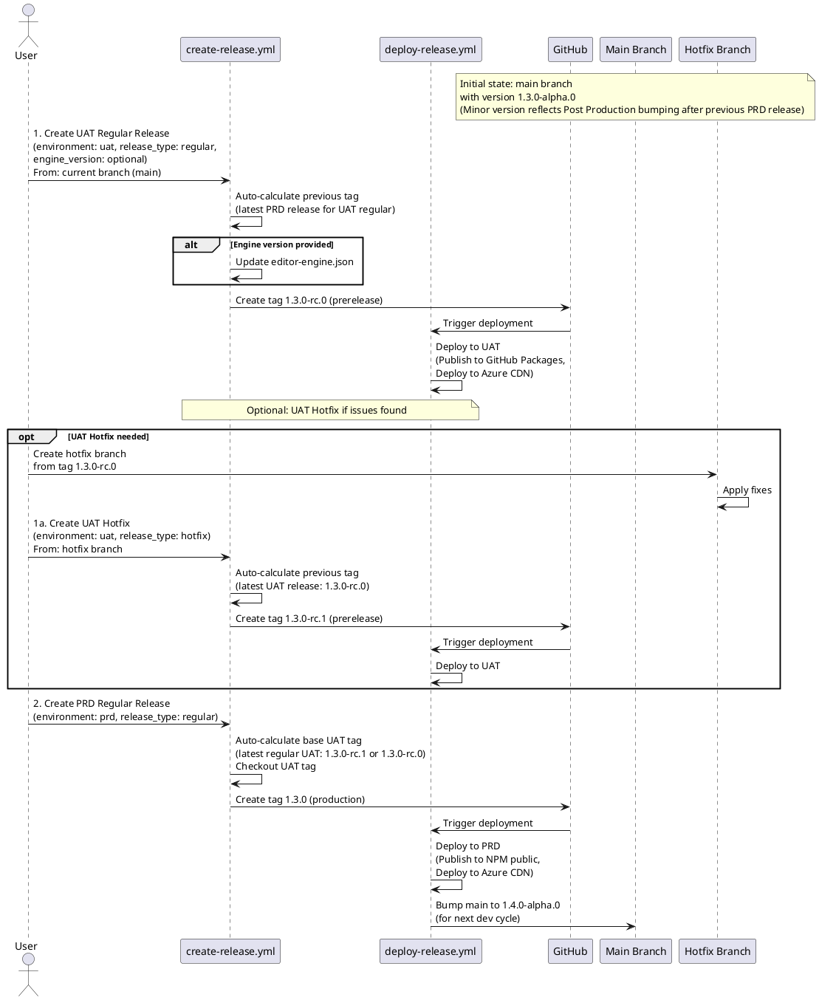
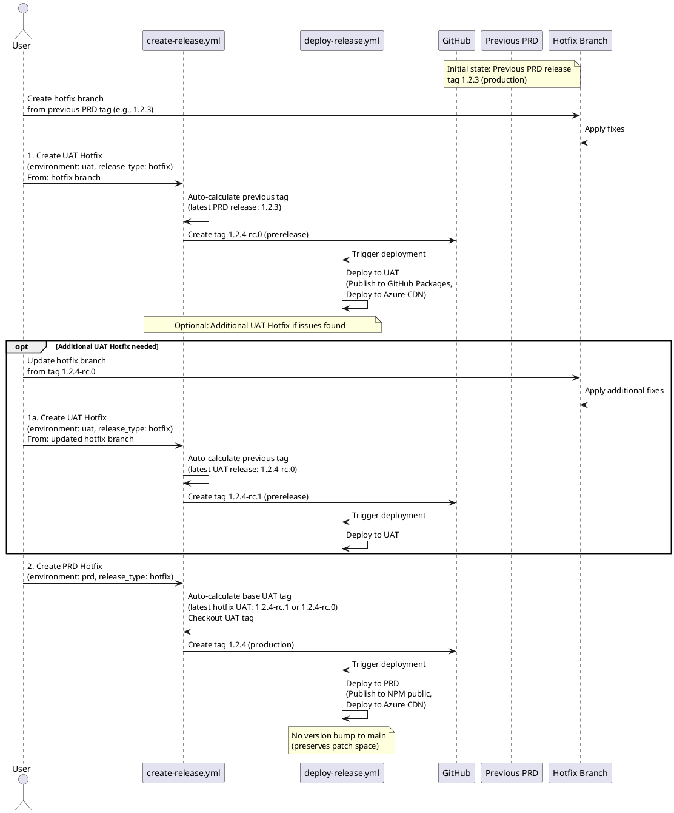

# Release Pipeline Sequence Diagram

## Regular Release Flow (main branch → UAT → PRD)

## Hotfix Release Flow (hotfix branch → UAT → PRD)

For detailed sequence diagrams of individual release flows, see [RELEASE_PIPELINE_DETAILED.md](./RELEASE_PIPELINE_DETAILED.md).
