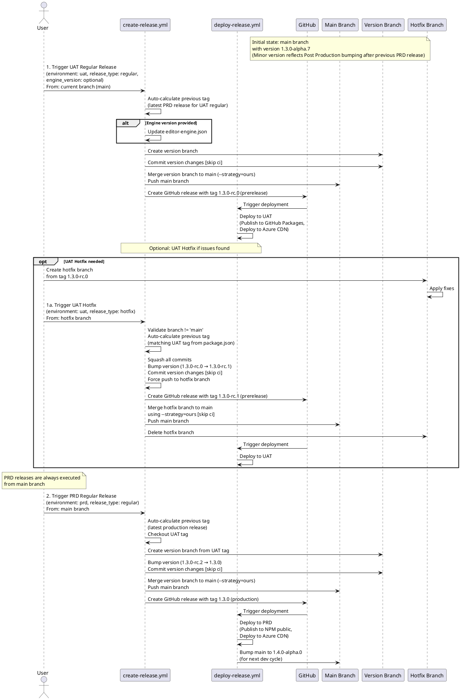
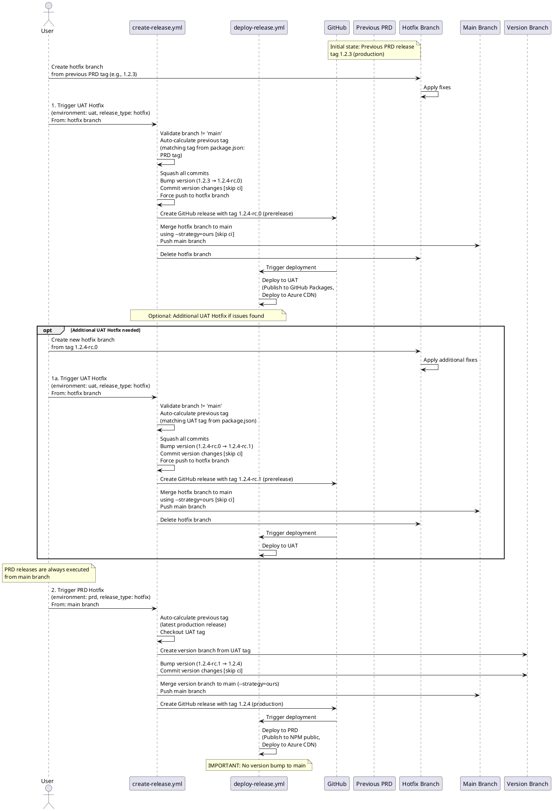

# Release Pipeline Sequence Diagram

## Regular Release Flow (main branch → UAT → PRD)

```plantuml
@startuml
actor User
participant "create-release.yml" as CreateRelease
participant "deploy-release.yml" as DeployRelease
participant "GitHub" as GitHub
participant "Main Branch" as Main
participant "Version Branch" as VersionBranch
participant "Hotfix Branch" as HotfixBranch

note over Main: Initial state: main branch\nwith version 1.3.0-alpha.7\n(Minor version reflects Post Production bumping after previous PRD release)

User -> CreateRelease: 1. Trigger UAT Regular Release\n(environment: uat, release_type: regular,\nengine_version: optional)\nFrom: current branch (main)
CreateRelease -> CreateRelease: Auto-calculate previous tag\n(latest PRD release for UAT regular)
alt Engine version provided
    CreateRelease -> CreateRelease: Update editor-engine.json
end
CreateRelease -> VersionBranch: Create version branch
CreateRelease -> VersionBranch: Commit version changes [skip ci]
CreateRelease -> Main: Merge version branch to main (--strategy=ours)\nPush main branch
CreateRelease -> GitHub: Create GitHub release with tag 1.3.0-rc.0 (prerelease)
GitHub -> DeployRelease: Trigger deployment
DeployRelease -> DeployRelease: Deploy to UAT\n(Publish to GitHub Packages,\nDeploy to Azure CDN)

note over CreateRelease,DeployRelease: Optional: UAT Hotfix if issues found

opt UAT Hotfix needed
    User -> HotfixBranch: Create hotfix branch\nfrom tag 1.3.0-rc.0
    HotfixBranch -> HotfixBranch: Apply fixes
    User -> CreateRelease: 1a. Trigger UAT Hotfix\n(environment: uat, release_type: hotfix)\nFrom: hotfix branch
    CreateRelease -> CreateRelease: Validate branch != 'main'\nAuto-calculate previous tag\n(matching UAT tag from package.json)
    CreateRelease -> CreateRelease: Squash all commits\nBump version (1.3.0-rc.0 → 1.3.0-rc.1)\nCommit version changes [skip ci]\nForce push to hotfix branch
    CreateRelease -> GitHub: Create GitHub release with tag 1.3.0-rc.1 (prerelease)
    CreateRelease -> Main: Merge hotfix branch to main\nusing --strategy=ours [skip ci]\nPush main branch
    CreateRelease -> HotfixBranch: Delete hotfix branch
    GitHub -> DeployRelease: Trigger deployment
    DeployRelease -> DeployRelease: Deploy to UAT
end

note over User: PRD releases are always executed\nfrom main branch
User -> CreateRelease: 2. Trigger PRD Regular Release\n(environment: prd, release_type: regular)\nFrom: main branch
CreateRelease -> CreateRelease: Auto-calculate previous tag\n(latest production release)\nCheckout UAT tag
CreateRelease -> VersionBranch: Create version branch from UAT tag
CreateRelease -> VersionBranch: Bump version (1.3.0-rc.2 → 1.3.0)\nCommit version changes [skip ci]
CreateRelease -> Main: Merge version branch to main (--strategy=ours)\nPush main branch
CreateRelease -> GitHub: Create GitHub release with tag 1.3.0 (production)
GitHub -> DeployRelease: Trigger deployment
DeployRelease -> DeployRelease: Deploy to PRD\n(Publish to NPM public,\nDeploy to Azure CDN)
DeployRelease -> Main: Bump main to 1.4.0-alpha.0\n(for next dev cycle)

@enduml
```

## Hotfix Release Flow (hotfix branch → UAT → PRD)

```plantuml
@startuml
actor User
participant "create-release.yml" as CreateRelease
participant "deploy-release.yml" as DeployRelease
participant "GitHub" as GitHub
participant "Previous PRD" as PRD
participant "Hotfix Branch" as HotfixBranch
participant "Main Branch" as Main
participant "Version Branch" as VersionBranch

note over PRD: Initial state: Previous PRD release\ntag 1.2.3 (production)

User -> HotfixBranch: Create hotfix branch\nfrom previous PRD tag (e.g., 1.2.3)
HotfixBranch -> HotfixBranch: Apply fixes
User -> CreateRelease: 1. Trigger UAT Hotfix\n(environment: uat, release_type: hotfix)\nFrom: hotfix branch
CreateRelease -> CreateRelease: Validate branch != 'main'\nAuto-calculate previous tag\n(matching tag from package.json:\nPRD tag)
CreateRelease -> CreateRelease: Squash all commits\nBump version (1.2.3 → 1.2.4-rc.0)\nCommit version changes [skip ci]\nForce push to hotfix branch
CreateRelease -> GitHub: Create GitHub release with tag 1.2.4-rc.0 (prerelease)
CreateRelease -> Main: Merge hotfix branch to main\nusing --strategy=ours [skip ci]\nPush main branch
CreateRelease -> HotfixBranch: Delete hotfix branch
GitHub -> DeployRelease: Trigger deployment
DeployRelease -> DeployRelease: Deploy to UAT\n(Publish to GitHub Packages,\nDeploy to Azure CDN)

note over CreateRelease,DeployRelease: Optional: Additional UAT Hotfix if issues found

opt Additional UAT Hotfix needed
    User -> HotfixBranch: Create new hotfix branch\nfrom tag 1.2.4-rc.0
    HotfixBranch -> HotfixBranch: Apply additional fixes
    User -> CreateRelease: 1a. Trigger UAT Hotfix\n(environment: uat, release_type: hotfix)\nFrom: hotfix branch
    CreateRelease -> CreateRelease: Validate branch != 'main'\nAuto-calculate previous tag\n(matching UAT tag from package.json)
    CreateRelease -> CreateRelease: Squash all commits\nBump version (1.2.4-rc.0 → 1.2.4-rc.1)\nCommit version changes [skip ci]\nForce push to hotfix branch
    CreateRelease -> GitHub: Create GitHub release with tag 1.2.4-rc.1 (prerelease)
    CreateRelease -> Main: Merge hotfix branch to main\nusing --strategy=ours [skip ci]\nPush main branch
    CreateRelease -> HotfixBranch: Delete hotfix branch
    GitHub -> DeployRelease: Trigger deployment
    DeployRelease -> DeployRelease: Deploy to UAT
end

note over User: PRD releases are always executed\nfrom main branch
User -> CreateRelease: 2. Trigger PRD Hotfix\n(environment: prd, release_type: hotfix)\nFrom: main branch
CreateRelease -> CreateRelease: Auto-calculate previous tag\n(latest production release)\nCheckout UAT tag
CreateRelease -> VersionBranch: Create version branch from UAT tag
CreateRelease -> VersionBranch: Bump version (1.2.4-rc.1 → 1.2.4)\nCommit version changes [skip ci]
CreateRelease -> Main: Merge version branch to main (--strategy=ours)\nPush main branch
CreateRelease -> GitHub: Create GitHub release with tag 1.2.4 (production)
GitHub -> DeployRelease: Trigger deployment
DeployRelease -> DeployRelease: Deploy to PRD\n(Publish to NPM public,\nDeploy to Azure CDN)
note over DeployRelease: IMPORTANT: No version bump to main

@enduml
```
